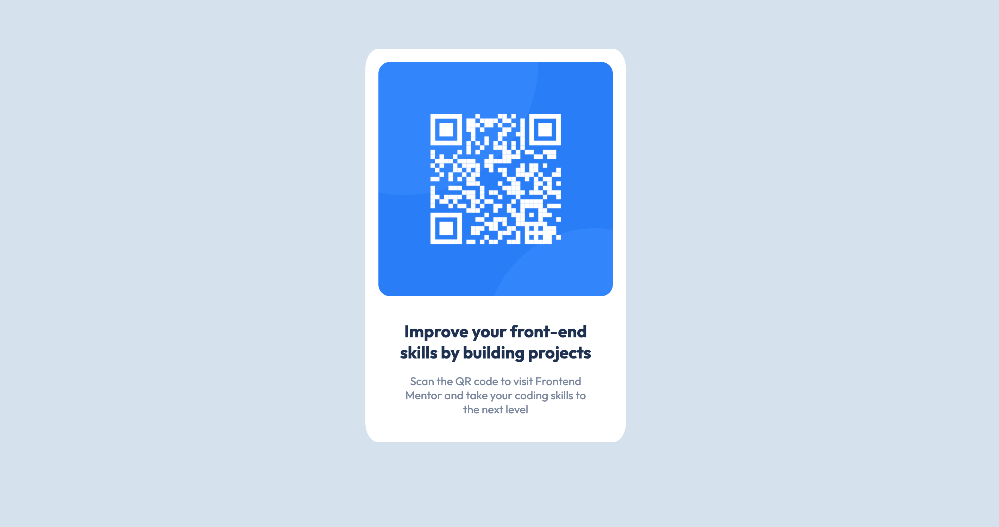
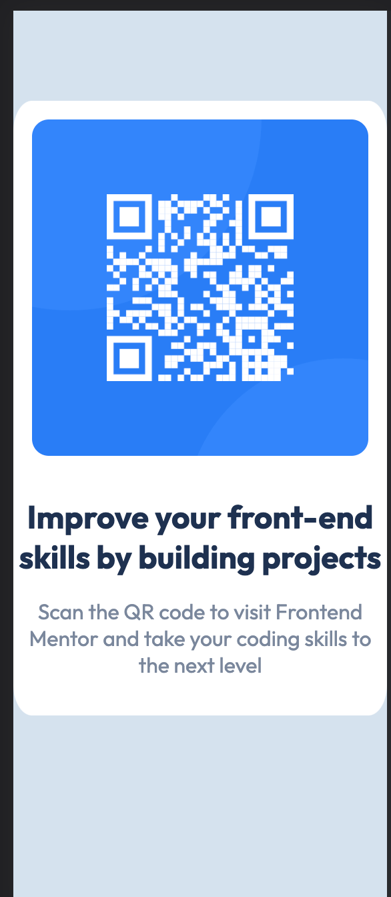

# FrontEndMentor_QRCODE
Front-end mentor challenge qr code component

# Frontend Mentor - QR code component solution

This is a solution to the [QR code component challenge on Frontend Mentor](https://www.frontendmentor.io/challenges/qr-code-component-iux_sIO_H). Frontend Mentor challenges help you improve your coding skills by building realistic projects. 

## Table of contents

- [Overview](#overview)
  - [Screenshot](#screenshot)
  - [Links](#links)
- [My process](#my-process)
  - [Built with](#built-with)
  - [What I learned](#what-i-learned)
  - [Continued development](#continued-development)
  - [Useful resources](#useful-resources)
- [Author](#author)
- [Acknowledgments](#acknowledgments)

## Overview

This is what I did to complete this challenge.

### Screenshot





### Links

- Solution URL: [Add solution URL here](https://github.com/arturo4ever/FrontEndMentor_QRCODE)
- Live Site URL: [Add live site URL here](https://arturo4ever.github.io/FrontEndMentor_QRCODE/)

## My process
I would like to keep learning frontend development.
### Built with

- Semantic HTML5 markup
- CSS custom properties
- Flexbox
- Mobile-first workflow
- [SASS](https://sass-lang.com/) - For styles


### What I learned

```css
.image {
  object-fit: cover;
  height: auto;
  width: auto;
  border-radius: 5%;
  margin: 5%;
}

img {
  height: 100%;
  width: 100%;
  border-radius: 5%;
}
```


### Continued development

I want to focus on learning React JS.

### Useful resources

- [CSS](https://developer.mozilla.org/en-US/docs/Learn/CSS) - This helped me for CSS.

## Author

- Website - [arturo4ever](https://github.com/arturo4ever)
- Frontend Mentor - [@arturo4ever](https://www.frontendmentor.io/profile/arturo4ever)

## Acknowledgments

Read, build, build, practice, build, practice, learn and have fun.
